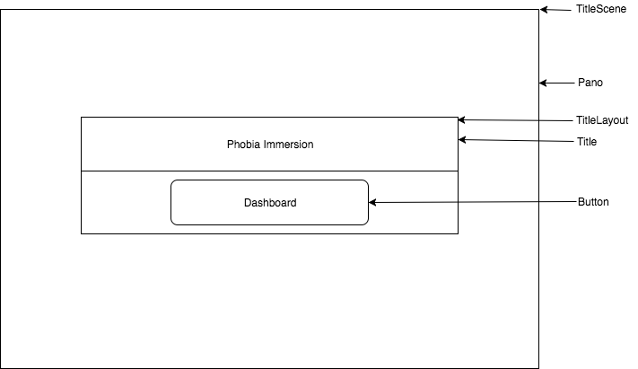
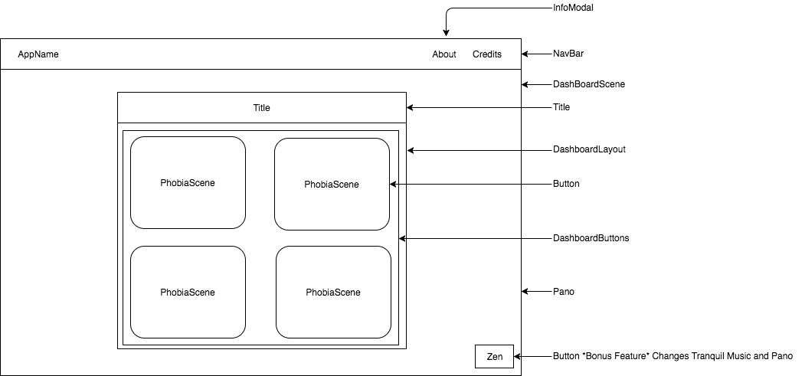
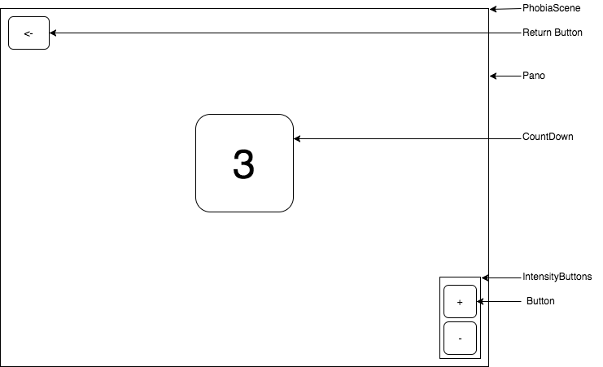

# Wireframes

## TitleScene

## Dashboard Scene

## Phobia Scene

### Notes
  - *All `Pano/VideoPano` Components will have `Sound` Components*
  - *`Return button` needs to be at an absolute position or click function so our users immediately exit if they're too terrified*

### Bonus Components
  - *`Intensity` will be a bonus feature*
  - *`Zen Mode` will generate a new pano image and tranquil sounds within the DashboardScene*
